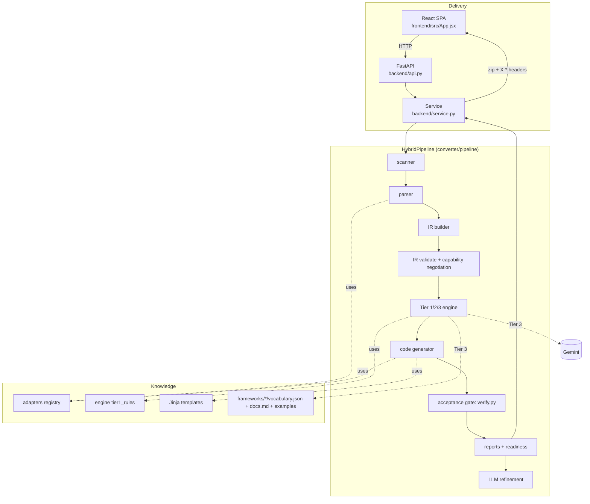
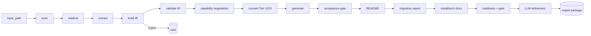
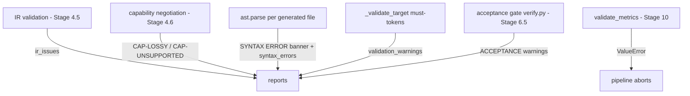
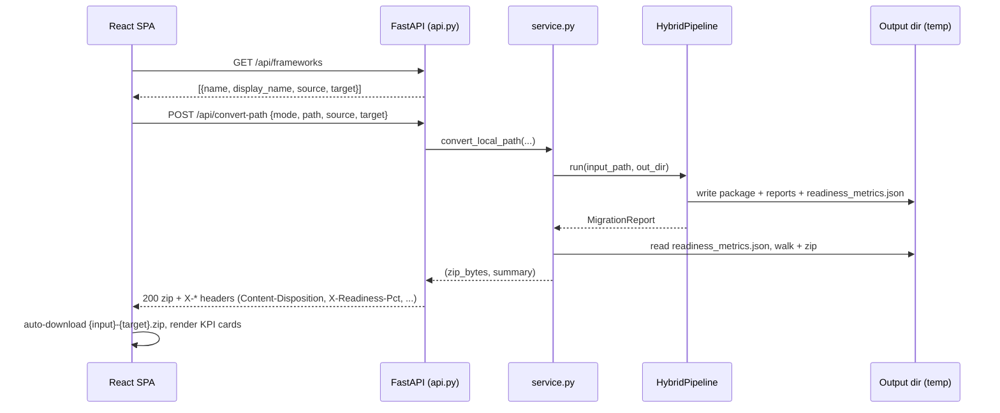
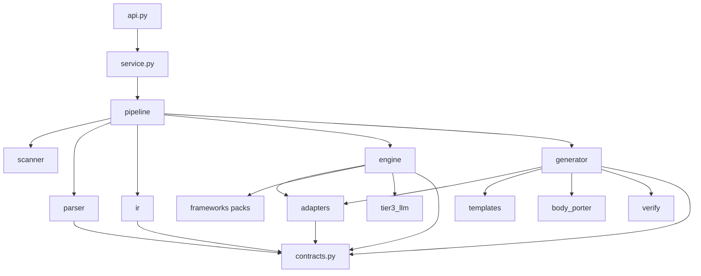

# Architecture

The authoritative architecture reference for the Framework Conversion Utility.
For the end-to-end data flow and how to extend each seam, see
[ENGINEERING_GUIDE.md](ENGINEERING_GUIDE.md); for per-framework semantics, see
[FRAMEWORK_REFERENCE.md](FRAMEWORK_REFERENCE.md).

---

## System architecture overview

The system converts an AI-agent codebase from one framework to another by
routing everything through a **framework-neutral Intermediate Representation
(IR)**. Three tiers of layering enforce that:

1. **Delivery layer** — a React SPA and a FastAPI service, both thin. They move
   files in and a zip + metrics out; they contain no conversion logic.
2. **Pipeline layer** — an ordered sequence of stages
   (`converter/pipeline/hybrid_pipeline.py`) that scans, parses, builds the IR,
   converts, generates, verifies, and reports.
3. **Knowledge layer** — adapters (`converter/adapters/`), Tier-1 rules
   (`converter/engine/`), Jinja templates (`converter/templates/`), and Tier-3
   knowledge packs (`converter/frameworks/`). All framework-specific knowledge
   lives here, behind interfaces.

The invariant that holds the design together: **nothing after the parser reads
the original source, and nothing before code generation knows the target
framework.** The IR (`converter/contracts.py`) is the only thing that crosses
that boundary.

## Architectural goals

- **Any-source → any-target without N×M code.** Achieved by the neutral IR: N
  source readers + M target writers, never N×M translators.
- **Frozen contracts.** `contracts.py` is explicitly frozen (Section 9 of the
  build plan). All three conversion modes and every adapter speak these exact
  dataclasses, so a change on one side never ripples.
- **Deterministic-first, LLM-only-where-needed.** Structure that can be
  converted by rule is (Tier 1/2); the LLM (Tier 3) is reserved for genuinely
  ambiguous orchestration and HITL, keeping output reproducible and cheap.
- **Runnable output, offline.** Generated packages import and run without the
  target SDK (import guards + offline `run()` +, for MAF, a bundled stub), so
  CI can smoke-test them immediately.
- **Honest reporting over silent success.** Every conversion emits Markdown
  reports bucketing work into auto / needs-review / manual, plus computed
  effort and accuracy metrics.
- **Onboarding a framework = adding files, not editing the core.**

## Frontend architecture

A single-page React 18 app built with Vite; the entire UI is one component,
`frontend/src/App.jsx` (no sub-components), with `frontend/src/styles.css`.

- **State** (React `useState`): input `method` (`path` | `upload`), `path`,
  `files`, `mode` (`llm` | `manual`), `frameworks`, `source`, `target`,
  custom-pack `packFiles`, transient flags (`reading`, `converting`), `status`,
  `result`, and a `log` array for the activity stream.
- **Framework discovery:** on mount it calls `GET /api/frameworks` and filters
  the result into Source and Target dropdowns (`f.source` / `f.target`). A
  sentinel value `__new__` ("New / custom framework…") switches on a
  `vocabulary.json` pack uploader and sets `target='dynamic'`.
- **Client-side pre-filtering:** `isSource()` drops dependency dirs
  (`IGNORE_DIRS`), binaries (`IGNORE_EXT`), and files over `MAX_FILE_BYTES`
  (1 MB) before upload — so path mode stays instant even for huge repos.
- **Conversion call:** `POST /api/convert-path` (path mode) or `/api/convert`
  (upload mode). The response is a zip blob auto-downloaded using the
  `X-Zip-Filename` header; KPI cards read `X-Target-Framework`,
  `X-Files-Converted`, `X-Conversion-Time`, `X-Readiness-Pct`,
  `X-Overall-Accuracy`, `X-Lowest/Highest-Accuracy`, `X-Total-Human-Time`.
- **Live activity log:** `startActivityStream()` simulates an 8-stage timed log
  (1300 ms interval) locally — it is *not* server-streamed, because the backend
  is a single synchronous endpoint (see *Service interactions*).

## Backend architecture

Two files, both thin:

- **`backend/api.py`** — the FastAPI app. Endpoints:
  `GET /api/frameworks` (dropdown data via `list_frameworks_detailed()`),
  `GET /api/health` (+ whether Gemini is configured), `POST /api/convert`
  (upload), `POST /api/convert-path` (read from disk). It builds the output zip
  filename (`_make_zip_filename` → `{input}-{target}.zip`), validates it, and
  attaches ~16 `X-*` headers (exposed via `Access-Control-Expose-Headers`). If
  `frontend/dist/` exists it also mounts the built SPA at `/`.
- **`backend/service.py`** — the conversion service used by both the API and the
  tests (no web imports, easy to test). `convert_folder` / `convert_local_path`
  write/resolve the input, call `_run_and_zip`, which runs `HybridPipeline`,
  reads the `readiness_metrics.json` sidecar (`_extract_report_summary`), walks
  the output into a zip, times the run (`_fmt_elapsed`), and returns
  `(zip_bytes, summary_dict)`.

Request models: `ConvertRequest`, `ConvertPathRequest` (pydantic). CORS is
open (`allow_origins=["*"]`).

## Conversion engine architecture

The pipeline is an ordered list of stages in
`converter/pipeline/hybrid_pipeline.py::HybridPipeline.run`. Each stage maps to
a numbered "Module" from the build plan:

| Stage | Module | Responsibility | Key call |
|---|---|---|---|
| 1 | M1 | Scan + validate repo → `manifest` | `scan_repo` |
| 2 | M3 | Parse README (kept verbatim for Tier 2) → `readme` | `parse_readme_file` |
| 3 | M4 | Parse every `.py`, consolidate, assign `file_action` → `inventory` | `extract_components` |
| 4 | M5 | Assemble IR, apply `--source` override, write `ir.json` | `build_ir`, `write_ir_json` |
| 4.5 | Phase 2 | Validate IR (non-fatal `ir_issues`) | `validate_ir` |
| 4.6 | Phase 5b | Capability negotiation vs target matrix | `negotiate`, `negotiation_summary` |
| 5 | M6 | Tier 1/2/3 conversion → `ConversionResult` | `convert` |
| 6 | M7 | Render + write output package | `generate_from_paths` |
| 6.5 | Phase 11 | Acceptance gate + `ACCEPTANCE.md` | `verify_output`, `write_acceptance` |
| 7 | M8 | Output README (target vocabulary) | `build_readme`, `write_readme` |
| 8 | M9 | `MIGRATION_REPORT.md` (returned `report`) | `build_report`, `write_report` |
| 9 | — | `INSTALL.md` + `ARCHITECTURE.md` | `write_docs` |
| 10 | — | Readiness report + **hard metrics gate** | `generate_readiness_report`, `validate_metrics` |
| 11 | — | LLM refinement repair loop | `run_llm_refinement` |

**Mode branching** is not inside `run()`; it is expressed by
`allow_llm_fallback` (constructor arg, derived from `Config.allow_llm_fallback`,
true only for `HYBRID`/`FULL_LLM`). Stage 5's `convert()` and Stage 11's
refinement early-return when it is false. The mode→pipeline mapping is
`PIPELINE_REGISTRY` in `converter/main.py`.

## Framework discovery architecture

Frameworks are discovered from three sources, unioned by
`adapters/__init__.py::list_frameworks_detailed()`:

1. `SOURCE_ADAPTERS` registry (built-in source readers),
2. `TARGET_ADAPTERS` registry (built-in target writers),
3. on-disk `frameworks/<name>/vocabulary.json` packs.

Each entry becomes `{name, display_name, source: bool, target: bool}`. A pack's
`supports_source` / `supports_target` keys and `display_name` feed the UI
directly, so **dropping a folder with a `vocabulary.json` makes a framework
appear in the API and UI with no code change**. Built-in class names take
precedence over on-disk packs of the same name.

`detect_source_framework(imported_roots)` picks the source when `--source` is
omitted: the registered `SourceAdapter` with the highest positive `detect()`
score wins (registry-driven, no hardcoded signature table).

## Framework abstraction layer

Two adapter families, both ABCs in `adapters/base.py`:

- **`SourceAdapter`** — owns how to *read* a framework: `import_signatures()`,
  `source_packages()` (dropped from output requirements), `vocabulary()` (a
  `SourceVocabulary` whose defaults are the LangGraph values), `detect()`, and
  optional `extract_agents()` / `extract_tasks()` / `extract_graph()` overrides
  for frameworks whose graph isn't graph-builder method calls (CrewAI, Strands).
- **`TargetAdapter`** — owns target *idioms*: `plugin_class_name()`,
  `method_name()`, `context_class_name`, `tool_style()`, `tool_decorator*()`,
  `runtime_requirements()`, `capability_matrix()`, `README_VOCAB`.

Paired with each target adapter is a **`TargetGenerator`**
(`generator/targets/base.py`, registry `TARGET_GENERATORS`) that emits the
framework-specific code: `workflow_block`, `entrypoint`, `smoke_test`,
`sdk_stub_files`, `extra_files`, `orchestrator_must_tokens`. The generator core
(`code_generator.py`) is a framework-agnostic dispatcher; it reads idioms off
the adapter and delegates framework-specific emission to the generator.

`DynamicTargetAdapter` is the "any target" seam: it is built at runtime from an
uploaded `vocabulary.json` (tool decorator, context class, requirements,
capability map, reject tokens), and pairs with the MAF generator as a fallback.

## Template rendering architecture

Deterministic (Tier 1/2) output is rendered with Jinja2 from
`converter/templates/` (`Environment(FileSystemLoader, keep_trailing_newline=True)`
in `code_generator.py::_env`). Four templates:

- `agent_context.py.jinja` — the state model (pydantic `BaseModel` with
  `advance(**updates)`; reducer fields extend lists, others replace).
- `orchestrator.py.jinja` — the orchestrator skeleton; its final slot
  `maf_workflow` receives *any* target's `workflow_block` (the variable name is
  legacy; it is not MAF-specific).
- `plugin_class.py.jinja` — Semantic-Kernel-style plugin classes (only for the
  `plugin_class` tool style; function-style targets skip it).
- `readme_maf.md.jinja` — the output README (title, purpose, skills, workflow,
  HITL, context fields, config).

Tier-3 LLM `generated_code` is not templated; it is stitched directly into
`orchestrator.py` (when a workflow unit carries `generated_code`, the
deterministic `maf_block` is replaced by it and the must-token check relaxes to
`["def run"]`).

## LLM integration architecture

Tier 3 uses Google Gemini, entirely optional and degrade-safe
(`engine/tier3_llm.py`):

- **Resolution order in `_call_gemini`:** injected client (tests) →
  `google-genai` SDK (`from google import genai`, with `truststore` TLS injection
  for corporate proxies) → stdlib `urllib` REST POST to the Generative Language
  API. Any failure returns `None`; nothing raises.
- **Gating:** returns `None` immediately if `not config.allow_llm_fallback` or no
  key/client — so deterministic mode never calls out.
- **Grounding:** `load_framework_docs(target)` reads the target's knowledge pack
  (`docs.md`, `vocabulary.json`, all `examples/*.py`) and prepends an
  "AUTHORITATIVE — this wins over prior knowledge" header before the prompt.
- **Where it fires:** only for orchestration shape Tiers 1/2 can't resolve
  (`resolve_with_llm`) and HITL nodes (`resolve_hitl`). Results are parsed into a
  frozen `Tier3Result(pattern, generated_code, reasoning, confidence)`; below
  `config.tier3_confidence_threshold` (0.70) the unit is flagged
  `needs_review`.
- **Second LLM stage:** `generator/llm_refinement.py` (Stage 11) is a
  gate-closed repair loop (max 3 iterations) that feeds the acceptance-gate
  failures + readiness report + current files back to Gemini, applies only
  patches that `ast.parse` cleanly and target files that already existed, and
  re-runs the gate. Writes `REFINEMENT_LOG.md`.

## Report generation architecture

Reports are the product's "explainability" layer:

- **`MIGRATION_REPORT.md`** (`report_generator.py::build_report`) — three
  buckets: *Auto-converted* (Tier 1/2 + confident Tier 3), *Needs review*
  (Tier 3 below threshold + `[VALIDATION]` warnings), *Manual action required*
  (R-08/R-15 stubs, unresolved workflow, `[SYNTAX]` ast failures).
- **`ACCEPTANCE.md`** (`verify.py`) — the acceptance gate's checks as data.
- **`READINESS_REPORT.md` + `readiness_metrics.json`**
  (`readiness_report.py`) — deterministically computed effort ranges
  (`recommended = (low + 2·high)/3`, per-item capped) and accuracy metrics
  (average/highest/lowest, confidence band, production-readiness label). The
  markdown may be LLM-authored, but the metrics and the summary block are always
  computed deterministically and validated by `validate_metrics()` (the
  pipeline's one hard gate). The JSON sidecar is what `service.py` reads to
  populate UI headers — no Markdown re-parsing.
- **`INSTALL.md` / `ARCHITECTURE.md`** (`docs_generator.py`) — so the output is
  self-describing.

## Configuration architecture

A single frozen dataclass `Config` (`config.py`) carries every knob: `mode`,
`source_framework`, `target_framework`, `tier3_confidence_threshold` (0.70),
`llm_model` / `llm_api_key_env` (`GEMINI_API_KEY`), `frameworks_dir`,
`required_readme_sections`, `extraction_exclude_dirs`, `validate_output`
(subprocess runnable checks; off in tests). Derived: `allow_llm_fallback`
(property), `resolved_model()` (honors `GEMINI_MODEL`), `llm_api_key()` (empty
string treated as absent). `.env` is loaded once by a dependency-free loader
where existing env vars always win.

## Validation architecture

Validation is layered and mostly *non-fatal* (recorded as data, surfaced in
reports) with exactly one hard gate:

- **IR validation** — `validate_ir()` produces non-fatal issues.
- **Capability negotiation** — LOSSY / UNSUPPORTED constructs become warnings.
- **Syntax** — every generated `.py` is `ast.parse`d in
  `code_generator._write_python`; failures get a `# SYNTAX ERROR` banner and are
  listed (still written, so a human can fix them).
- **Must-tokens** — `_validate_target` checks framework constructs are present
  (e.g. `WorkflowBuilder`, `@executor` for MAF; `StateGraph` for LangGraph;
  `Agent`, `_HAVE_STRANDS` for Strands).
- **Acceptance gate** — `verify.py` runs 7 checks (all `.py` compile; no
  source-framework residue; clean `requirements.txt`; IR coverage; required
  orchestrator tokens; loop reachability; opt-in subprocess run). Never raises.
- **Metrics gate** — `validate_metrics()` is the only hard failure: it aborts if
  the readiness metrics are missing/invalid.

## Logging architecture

Logging is intentionally **minimal**. There is no central logger config, no
handlers, and no structured logging layer. The one production logger is in
`parser/readme_parser.py` (`logger.warning` for a missing README section). The
CLI uses `print()` for user output; the dominant error idiom is *swallow and
degrade* (broad `except: pass` / `return None`) so the pipeline never crashes on
an optional step. **Diagnostics are delivered through the generated Markdown
reports** (`MIGRATION_REPORT`, `ACCEPTANCE`, `READINESS_REPORT`,
`REFINEMENT_LOG`), not through logs. This is a deliberate trade-off (see below)
and a known area for hardening.

## Component responsibilities

| Component | Responsibility |
|---|---|
| `frontend/src/App.jsx` | Collect input, call the API, render KPIs/activity, download the zip. |
| `backend/api.py` | HTTP surface, zip naming/headers, static SPA mount. |
| `backend/service.py` | Run the pipeline, package the zip, extract metrics. |
| `converter/scanner.py` | Discover + validate source files, ignore dependency dirs. |
| `converter/parser/` | README parsing + AST extraction into inventory. |
| `converter/ir/` + `contracts.py` | Assemble + validate the neutral IR. |
| `converter/engine/` | Tier 1/2/3 conversion decisions + capability negotiation. |
| `converter/generator/` | Emit target code, port logic, verify, generate reports. |
| `converter/generator/targets/` | Framework-specific code emission. |
| `converter/adapters/` | Framework knowledge behind interfaces + registry. |
| `converter/templates/` | Deterministic code/README rendering. |
| `converter/frameworks/` | Tier 3 knowledge packs + `vocabulary.json`. |

## Service interactions

The whole pipeline runs **synchronously inside the request**. There is no job
queue; the SPA's activity log is a client-side simulation, not a server stream.

## Dependency relationships

Everything points at `contracts.py`; nothing in the engine or generator imports
the delivery layer. The adapters and Tier-3 packs are the only places with
framework literals.

## Design decisions and rationale

- **Neutral IR (why, not just what):** direct framework-to-framework translation
  is O(N×M) and every new framework destabilises the others. The IR makes it
  O(N+M) and lets the test matrix guarantee "improving one target can't regress
  another" (`test_all_frameworks_matrix.py`).
- **Frozen contracts:** freezing `contracts.py` lets three conversion modes and
  every adapter evolve independently — the compile-time-ish guarantee that the
  seams won't drift.
- **AST-only parsing, no regex on Python:** regex over source is brittle; the
  parser walks the real AST and is driven purely by a `SourceVocabulary`, so a
  new source is a data change, not new parsing code.
- **Tiered engine:** deterministic rules are reproducible, free, and reviewable;
  the LLM is expensive and non-deterministic. Using the LLM only for what rules
  can't resolve keeps most output stable and auditable.
- **Offline-runnable output (MAF SDK stub):** shipping a pure-Python stub +
  import guards means CI can import/smoke-test the converted package with no SDK,
  and the deterministic `run()` still works — critical because the converter
  never executes agents itself.
- **Reports as the observability layer:** since runtime is never verified, the
  product's trust comes from explicit, computed reports rather than a green
  checkmark.
- **Metrics computed deterministically, JSON sidecar for the UI:** avoids
  re-parsing Markdown and guarantees the manager-facing numbers are exact and
  gate-validated.

## Trade-offs and limitations

- **Synchronous conversion.** Simple and stateless, but a long conversion blocks
  the worker; no progress streaming (the UI simulates it). Fine for local/single
  use; needs a queue for multi-tenant scale.
- **Minimal logging.** Great for "never crash," poor for post-hoc debugging of a
  silently-degraded step. Reports partially compensate.
- **No runtime verification.** Syntax + import + acceptance gate only. A
  converted agent can compile and still misbehave at runtime (ported business
  logic, or a non-target LLM client that isn't auto-rewritten to the target's
  provider).
- **LLM semantic limits.** Tier 3 can produce plausible-but-wrong orchestration;
  the confidence threshold and `needs_review` bucket mitigate but don't
  eliminate this.
- **Open CORS.** Convenient in dev, unsafe in production.

## Scalability considerations

- Conversion is CPU-bound and stateless per request; horizontal scaling is just
  more uvicorn workers behind a load balancer — but each request holds a worker
  for the full pipeline. For throughput, move `HybridPipeline.run` behind a task
  queue and stream progress over websockets/SSE instead of the current
  client-side simulation.
- Path mode avoids upload cost entirely (backend reads disk, skips
  `extraction_exclude_dirs`), so large monorepos convert quickly; upload mode is
  bounded by browser pre-filtering (`MAX_FILE_BYTES`, ignore lists).
- Tier 3 latency dominates when enabled; deterministic mode is near-instant.

## Security considerations

- **CORS `*`** — lock down before public exposure.
- **Path mode reads arbitrary server paths** — only expose to trusted callers;
  treat the path as untrusted input for traversal.
- **Secrets never copied** — `code_generator._is_secret_file` blocks `.env`,
  keys, and credentials from the output; a `.env.example` is emitted instead.
- **LLM data egress** — Tier 3 sends source snippets to Gemini; deterministic
  mode keeps everything local. Choose the mode accordingly for sensitive code.
- **Generated code is not sandboxed** — the converter never runs it, but a human
  who does should review the `MIGRATION_REPORT.md` first.

## Extensibility model

Adding a framework is additive — new files against the frozen contracts, no core
edits — with four levels of investment:

- **Level 0 (data only):** drop `frameworks/<name>/vocabulary.json` → appears in
  the UI, served as a `DynamicTargetAdapter` with the MAF generator.
- **Level 1:** add a `TargetAdapter` (idioms, capability matrix).
- **Level 2:** add a `TargetGenerator` (framework-specific code shape).
- **Level 3:** add a `SourceAdapter` (read a new source framework).

Register in the `SOURCE_ADAPTERS` / `TARGET_ADAPTERS` / `TARGET_GENERATORS`
dicts, add the pair to `test_all_frameworks_matrix.py`, and the discovery layer
does the rest. Full recipes with code are in
[ENGINEERING_GUIDE.md](ENGINEERING_GUIDE.md) and
[FRAMEWORK_AUTHORING.md](FRAMEWORK_AUTHORING.md).
