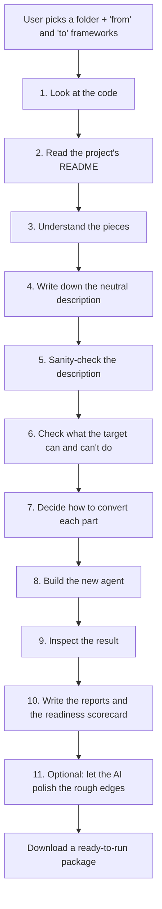

# How the Framework Conversion Utility Works — In Plain Words

*A manager-friendly walkthrough of what happens when an agent is converted from
one framework to another, and why each step exists.*

---

## The one-sentence version

We take an AI agent written in one framework (say **LangGraph**), understand
what it *does* — its tools, its state, its workflow — write that understanding
down in a neutral form, and then re-build the same agent in a different framework
(say **AWS Strands**), along with a report that tells you how much is ready and
what still needs a human.

---

## Why we built it this way

**The problem.** Every agent framework (LangGraph, Microsoft Agent Framework,
CrewAI, AWS Strands) expresses the same ideas differently. Moving an agent from
one to another is normally a manual rewrite that takes days and is easy to get
wrong.

**The naive approach** would be to write a direct translator for every pair of
frameworks. With 4 frameworks that's 12 translators; with 6 it's 30. Every new
framework destabilises all the others.

**Our approach.** We translate through a single neutral description in the
middle — think of it as a universal "meaning" of the agent. Every framework
needs only:

- one **reader** (how to understand it), and
- one **writer** (how to produce it).

So adding a framework is *adding one reader and one writer*, not rewriting
everything. This is the single most important design decision in the product.

> **The golden rule:** once we've understood the source agent, we never look at
> the original code again; and until the very last step, we never think about
> the target framework. The neutral description is the only thing that crosses
> the middle. That separation is what keeps the system simple as it grows.

---

## The flow, step by step

Here is the journey of one conversion, from the button click to the download.

> Each step names the exact file and function that does the work, so an engineer
> can follow along, but the description stays plain English. The whole sequence
> is wired together in one place: `converter/pipeline/hybrid_pipeline.py`, in the
> `HybridPipeline.run()` method. That method holds no logic of its own — it just
> calls each stage below in order.

### 1. Look at the code
**Runs:** `converter/scanner/repo_scanner.py::scan_repo`.
We walk the project folder and, using the helper `_iter_repo_files`, skip the
noise — virtual environments, caches, `node_modules` — so we only ever work on
real source. `_classify_file` tags each file (README, Python, requirements) so
later stages know how to treat it, and `_detect_framework` reads the imports
(via Python's AST, never fragile text matching) and asks the framework registry
`detect_source_framework` which framework this looks like. That auto-detection
means the user usually doesn't have to tell us the source. The step produces a
`RepoManifest` — the validated file list — and hard-stops with a clear message
if the folder isn't a real agent project.

### 2. Read the project's README
**Runs:** `converter/parser/readme_parser.py::parse_readme_file`.
We read the human-written `README.md` and split it into sections — purpose,
tools, state, and the workflow description. The result is a `ReadmeSections`
object. Why bother, when we also read the code? Because when the code's
structure is ambiguous, the author's own words are often the clearest statement
of what the workflow is *meant* to do. We deliberately keep the workflow
description **word-for-word** rather than summarising it, because a later step
(Tier 2) classifies the workflow by matching keywords in that original prose.
It's a cheap, high-signal input that costs us nothing to preserve.

### 3. Understand the pieces
**Runs:** `converter/extractor/component_extractor.py::extract_components`.
This is where we turn code into understanding. It pulls the framework's
"vocabulary" from the source adapter (`get_source_adapter().vocabulary()`) and
runs the framework-neutral parser `converter/parser/code_parser.py` — the
`extract_tools`, `extract_graph`, `extract_state`, `extract_config`, and
`extract_functions` functions — over every file. It then merges the per-file
results into one picture and calls `_cross_reference` to compare code against the
README, flagging mismatches (the code always wins). Finally `_assign_file_action`
decides, per file, whether the generator will rewrite, adapt, or copy it. Output:
a `ComponentInventory` — every tool, state field, and workflow step, named.

### 4. Write down the neutral description
**Runs:** `converter/ir/ir_builder.py::build_ir` (then `write_ir_json`).
We assemble everything into the **Intermediate Representation (IR)** — the
single, framework-neutral "meaning" of the agent. Helpers classify each step's
role (`_classify_roles`) and the overall workflow shape (`_classify_pattern` —
linear, branching, looping), detect loops and their exit conditions
(`_loop_guards`), and capture human-approval points word-for-word
(`_build_hitl_points`). We save a copy to `ir.json` for debugging. This is the
pivot of the whole system: from here on, **no step ever looks at the original
code again, and nothing yet knows the target framework**. The IR is the only
thing that crosses the middle.

### 5. Sanity-check the description
**Runs:** `converter/ir/validator.py::validate_ir`.
Before building anything, we validate the IR for internal contradictions — for
example, a workflow step that reads a piece of state that was never declared.
These findings are **non-fatal**: we don't stop the conversion, we attach them
to the final report (tagged `[IR]`) so a human sees the source inconsistency
plainly. Why not just fail? Because a partially-inconsistent agent can still be
90% converted usefully; stopping would throw that away. Catching problems here —
before code generation — means the eventual output and its reports are honest
about what came in, rather than silently producing something subtly wrong.

### 6. Check what the target can and can't do
**Runs:** `converter/engine/capability_negotiation.py::negotiate`.
Frameworks aren't equal. Some have no built-in "pause for human approval," some
have no saved-progress (checkpointing) feature, some model multi-agent
differently. This step compares every construct the IR needs against the target
framework's declared `capability_matrix()` and rates each as fully supported,
**lossy** (doable but with compromise), or **unsupported**. Anything lossy or
unsupported is recorded (tagged `[CAP-LOSSY]` / `[CAP-UNSUPPORTED]`) so it's
labelled up front. Why before building? So the generator can mark those spots
with clear stubs and notes, instead of a developer discovering a silently
dropped feature later. It sets honest expectations early.

### 7. Decide how to convert each part
**Runs:** `converter/engine/conversion_engine.py::convert`.
For each piece we pick the cheapest reliable method, escalating only when needed:
**Tier 1** (`tier1_rules.py`) handles clean, predictable mappings with
deterministic rules — fast, free, reproducible; **Tier 2**
(`tier2_readme.py::classify_from_readme`) uses the README's own words when the
structure is ambiguous; **Tier 3** (`tier3_llm.py`) sends only the genuinely hard
parts — complex orchestration, human-approval flows — to the AI (Google Gemini).
Why the ladder? Most of a conversion is mechanical; using an AI everywhere would
be slow, costly, and unpredictable, so we reserve it for judgment calls. If no AI
key is set, those hard parts become clearly-marked stubs — nothing breaks. The
output is a list of decisions (`ConversionResult`).

### 8. Build the new agent
**Runs:** `converter/generator/code_generator.py::generate_from_paths`.
Now we write real code in the target framework. The core generator is
framework-agnostic; it delegates the framework-specific shape to a
`TargetGenerator` (e.g. `targets/aws_strands_generator.py`) and reads idioms
(which decorator, which context class) from a `TargetAdapter`. The tricky part —
translating the source's logic, like turning `state["x"]` into `ctx.x` — is done
by `body_porter.py`. Files are rendered from Jinja templates in
`converter/templates/`. The result (`GenerationResult`) is a complete,
self-contained project: tools, state, workflow, entry point, a smoke test, and a
dependency list. It's even designed to import and run **without** the target SDK
installed, so it can be tested immediately.

### 9. Inspect the result
**Runs:** `converter/verify.py::verify_output`.
An automated "acceptance gate" runs seven checks on the generated package: every
file compiles, no leftovers from the *old* framework snuck through, the
dependency list is clean, every original tool/step/approval-point has a home,
the expected target constructs are present, and any loops are reachable. The
results are written to `ACCEPTANCE.md`, and any failures are attached to the
report (tagged `[ACCEPTANCE]`). Crucially, this gate **never crashes the
process** — a failed check is information, not an exception. The point is trust:
we verify the output is coherent and residue-free before anyone relies on it,
rather than assuming the generation step got everything right.

### 10. Write the reports and the readiness scorecard
**Runs:** `converter/generator/report_generator.py::build_report` and
`converter/generator/readiness_report.py::generate_readiness_report`.
We produce plain-English reports: a **migration report** (`MIGRATION_REPORT.md`)
bucketing everything into auto-converted / needs-review / manual, and a
**readiness scorecard** (`READINESS_REPORT.md` plus a machine-readable
`readiness_metrics.json`). The scorecard's numbers — estimated effort, accuracy,
production-readiness — are computed deterministically by
`compute_readiness_metrics`, so they're consistent every run, and
`validate_metrics` is the one place we *will* hard-stop if the numbers are
missing. Why: this turns "here's some code" into "here's exactly what's left and
roughly how long it'll take," which is what makes the work reviewable and
plannable. The web UI reads its KPI cards straight from that JSON.

### 11. Optional: let the AI polish the rough edges
**Runs:** `converter/generator/llm_refinement.py::run_llm_refinement`.
If an AI key is available, we run a "repair loop": we feed the AI the actual
acceptance-gate failures plus the current code (`_build_prompt`), let it propose
fixes, and apply only the ones that are safe — `_apply_patches` keeps a change
only if it parses cleanly and touches a file that already existed, so the AI can
never introduce broken or foreign files. Then we re-run the gate and repeat, up
to a few times, until it's green. Why: to automatically close as many leftover
gaps as possible before a human looks. It's skipped entirely without an AI key
and can only *improve* the result, never break it. It writes `REFINEMENT_LOG.md`.

### The result
The user downloads a single zip named after their project and the target
framework (e.g. `my-agent-aws-strands.zip`), containing the runnable agent and
all the reports.

---

## What we deliberately *don't* do

- **We don't run the converted agent.** We check that it's syntactically correct
  and complete, but actually executing it (with real credentials and data) is a
  human step. We're explicit about this so nobody assumes a green result means
  "fully tested in production."
- **We don't hide the hard parts.** Anything the tools can't do perfectly —
  a complex human-approval flow, a provider-specific detail — is *labelled* in
  the reports rather than quietly guessed. Honesty over false confidence.

---

## Why this matters to the business

- **Speed:** a multi-day manual migration becomes a minutes-long conversion plus
  a focused review.
- **Lower risk:** choosing a framework is no longer a one-way door — you can
  re-target a working agent cheaply.
- **Predictability:** every conversion comes with an effort estimate and a
  readiness score, so the remaining work can actually be planned.
- **Scales cleanly:** supporting a new framework is additive — one reader and/or
  one writer — without disturbing what already works.
