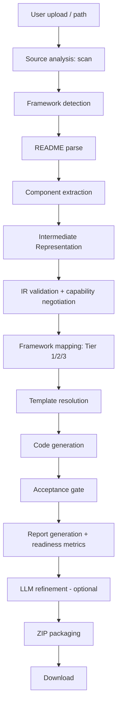
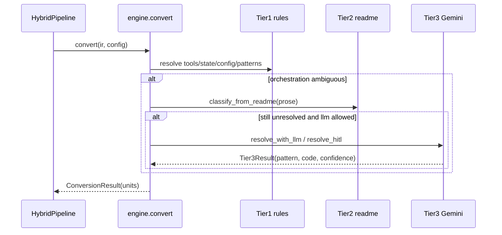

# Engineering Guide

The primary technical reference for how the Framework Conversion Utility works
end to end. Read [README.md](README.md) for setup and [ARCHITECTURE.md](ARCHITECTURE.md)
for the component-level view; this document is the *execution flow*, the
*codebase walkthrough*, *onboarding*, and *how to extend every seam*.

---

## Contents

- [Execution flow (stage by stage)](#execution-flow-stage-by-stage)
- [Codebase walkthrough](#codebase-walkthrough)
- [Key execution paths](#key-execution-paths)
- [Developer onboarding](#developer-onboarding)
- [Extending the platform](#extending-the-platform)

---

## Execution flow (stage by stage)

The orchestration lives in `converter/pipeline/hybrid_pipeline.py::HybridPipeline.run`.
Below, each logical stage is documented with the fields the spec asked for.

### 0. User upload / entry

- **Purpose:** get the source agent and the source/target choice into the
  backend.
- **Inputs:** a local path (path mode) or a list of `{path, content}` files
  (upload mode), plus `mode`, `source`, `target`, optional `framework_files`.
- **Outputs:** a temp input directory the pipeline can scan.
- **Key files:** `backend/api.py` (`/api/convert`, `/api/convert-path`),
  `backend/service.py` (`convert_folder`, `convert_local_path`, `_run_and_zip`).
- **Key functions:** `strip_common_top` (drop a shared top folder so `README.md`
  is at root), `save_framework_pack` (persist an uploaded `vocabulary.json`).
- **State changes:** upload mode writes files to a `tempfile.mkdtemp("fcu_in_")`;
  output goes to `tempfile.mkdtemp("fcu_out_")`.
- **Validation:** unknown `target`/`source` → `ValueError`; empty files / blank
  path → `HTTPException(400)`.
- **Error handling:** `api.py` maps `ScannerError`/`ValueError` → 400, other
  exceptions → 500.
- **Failure scenarios:** wrong path, unknown framework, empty upload.

### 1. Source analysis (scan)

- **Purpose:** discover the source files worth converting and validate the repo.
- **Inputs:** the input directory + `Config`.
- **Outputs:** a `RepoManifest` (`input_root`, `files: list[FileEntry]`,
  `detected_framework`, `readme_path`).
- **Core logic:** walk the tree, skip `Config.extraction_exclude_dirs`
  (`.venv`, `node_modules`, `__pycache__`, `tests`, `examples`, …), classify each
  file (`FileType`), require a root `README.md` and ≥1 `.py`.
- **Key file/functions:** `converter/scanner.py::scan_repo`.
- **Validation / errors:** raises `ScannerError` on a bad repo (surfaced as 400).
- **Logging:** none (failures raise).

### 2. Framework detection

- **Purpose:** decide the source framework when `--source` is omitted.
- **Inputs:** the set of imported top-level module roots.
- **Outputs:** a source framework name (feeds `IRMetadata.source_framework`).
- **Core logic:** `detect_source_framework(imported_roots)` asks each registered
  `SourceAdapter.detect()` for a confidence score; highest positive wins. Default
  `detect()` returns 1.0 if any `import_signatures()` root was imported
  (`langgraph`→langgraph, `crewai`→crewai, `strands`→aws_strands,
  `agent_framework`→maf).
- **Key files:** `adapters/__init__.py`, `adapters/source/*_adapter.py`.
- **State changes:** an explicit `--source`/`source=` overrides detection at IR
  build (Stage 4).

### 3. README parse

- **Purpose:** capture the human description of the workflow for Tier 2.
- **Inputs:** `README.md`.
- **Outputs:** a `ReadmeSections` object (Purpose, Framework, Tools, Workflow,
  State, Configuration, Dependencies).
- **Key files/functions:** `parser/readme_parser.py::parse_readme_file`.
- **Logging:** the *only* production logger — `logger.warning("README missing
  '## %s' section", ...)` for absent required sections.
- **Failure scenarios:** missing sections are warned, not fatal.

### 4. Component extraction

- **Purpose:** turn source `.py` into structured components (AST-only, no regex).
- **Inputs:** the manifest + readme + `Config`.
- **Outputs:** a `ComponentInventory` (`tools`, `graph: GraphSpec`, `state`,
  `config`, `functions`, `imports`, `preamble`, `state_class_names`,
  `checkpointer`, `agent_specs`, `task_specs`, `warnings`) with a `file_action`
  assigned per file (`REWRITE` / `ADAPT` / `COPY_THROUGH`).
- **Core logic:** `extract_components` drives the vocabulary-driven parser
  (`parser/code_parser.py`): `extract_tools` (decorator in
  `vocab.tool_decorators`), `extract_functions`, `extract_graph`
  (`vocab.graph_methods` → nodes/edges/conditional edges), `extract_state`
  (`vocab.state_base_classes`, append-only detection for `Annotated[list, add]`),
  `extract_config`, `extract_imports` (drops `vocab.dropped_import_roots`),
  `extract_preamble`. CrewAI/Strands adapters override `extract_graph` /
  `extract_agents` / `extract_tasks`.
- **Key classes:** `SourceVocabulary` (defaults are LangGraph's values).
- **State changes:** none persistent.
- **Failure scenarios:** an unparseable file is skipped/flagged; extraction never
  crashes the pipeline.

### 5. Intermediate Representation

- **Purpose:** assemble the single, frozen source of truth.
- **Inputs:** the inventory + metadata + source override.
- **Outputs:** an `IR` (`metadata`, `tools`, `state`, `config`, `workflow`,
  `functions`, `imports`, `preamble`, `state_class_names`, `files`,
  `agent_specs`, `task_specs`) and an `ir.json` debug checkpoint.
- **Core logic:** `build_ir(...)`; classifies orchestration into a
  `WorkflowSpec` (`OrchestrationPattern`: LINEAR / BRANCH / LOOP /
  LOOP_WITH_EXIT / AGENT_DRIVEN), flattens routers into `FlatEdge`s, records
  `LoopGuard`s and `HitlPoint`s, and sets `OrchestrationMode`
  (SINGLE_AGENT vs GRAPH_WORKFLOW).
- **Key files:** `converter/ir/…`, `contracts.py`, `write_ir_json`.
- **State changes:** writes `ir.json` to the cwd (debugging artifact).

### 4.5 IR validation

- **Purpose:** catch structural problems before generating anything.
- **Inputs/outputs:** `IR` → `ir_issues: list[str]` (non-fatal).
- **Key function:** `validate_ir(ir)`.
- **Error handling:** issues are carried forward and later prefixed `[IR]` into
  `generation.validation_warnings`.

### 4.6 Capability negotiation

- **Purpose:** compare what the IR needs against what the target supports.
- **Inputs:** IR + `target_adapter.capability_matrix()`.
- **Outputs:** `CapabilityNegotiation` records; `[CAP-LOSSY]` /
  `[CAP-UNSUPPORTED]` appended to `ir_issues`; a `negotiation_summary` one-liner.
- **Core logic:** `engine/capability_negotiation.py::negotiate` runs ordered
  `_PRESENCE_CHECKS` over `ConstructType` (TOOLS, STATE_TYPED, STATE_SHARED,
  CONDITIONAL_EDGES, LOOPS, HITL, CHECKPOINTING, MULTI_AGENT, AGENT_ROLES),
  mapping each present construct to `ConstructSupport` (DIRECT omitted; LOSSY →
  emulation note; UNSUPPORTED → manual action).

### 6 (map). Framework mapping — Tier 1/2/3

- **Purpose:** decide *how* each construct is converted (not emit code yet).
- **Inputs:** the IR + `Config`.
- **Outputs:** a `ConversionResult` (`units: list[ConversionUnit]`), each unit
  carrying `rule_id`, `tier`, `source_ref`, `target_ref`, `generated_code`,
  `confidence`, `needs_review`, `manual_action`.
- **Core logic:** `engine/conversion_engine.py::convert`:
  - **Tier 1** (`tier1_rules.py`, `R-01…R-15`) — deterministic: tools → plugin
    methods (R-01), state fields (R-02/R-11/R-12), config constants (R-14), LLM
    adapt (R-10), checkpointer TODO (R-15), and clean patterns LINEAR (R-04),
    small BRANCH (R-05), LOOP/LOOP_WITH_EXIT (R-06).
  - **Tier 2** (`tier2_readme.py`, `R-TIER2`) — classify ambiguous orchestration
    from the verbatim README workflow prose by keyword.
  - **Tier 3** (`tier3_llm.py`, `R-TIER3`) — Gemini for orchestration Tiers 1/2
    can't resolve and for HITL (R-08). Confidence `< 0.70` → `needs_review`.
    Unavailable/deterministic → `Tier.UNRESOLVED` with `manual_action`.
- **Validation:** Tier 3 JSON is parsed into a frozen `Tier3Result`.
- **Error handling:** every LLM path returns `None` on failure and degrades.
- **Failure scenarios:** no key → unresolved units become manual-action stubs.

### 6 (generate). Template resolution & code generation

- **Purpose:** render the target package from the IR.
- **Inputs:** IR + `ConversionResult` + input root.
- **Outputs:** a `GenerationResult` (`written_files`, `copied_files`,
  `syntax_errors`, `validation_warnings`) and the files on disk.
- **Core logic:** `generator/code_generator.py::generate` /
  `generate_from_paths`:
  1. **Plugins** — one module per source tools file; tools re-decorated with the
     target decorator (`adapter.tool_decorator_call`) via
     `_plugin_module_from_source`, pruned of source-framework machinery
     (`_prune_carried_tool_module` strips state classes, node/router functions,
     graph assembly, LLM-ctor assignments, unused imports) and foreign tool
     decorators (`_FOREIGN_TOOL_DECORATORS`).
  2. **`agent_context.py`** — from `agent_context.py.jinja` (state → pydantic
     `BaseModel` + `advance`).
  3. **`config.py`** — carried constants.
  4. **`orchestrator.py`** — ported node functions (`body_porter.port_node_function`,
     state→ctx AST transform), routers/helpers (`port_plain_function`), a
     synthesized `run()` (`_run_block`, honoring pattern/loops/branch), and the
     target's `workflow_block` in the `maf_workflow` slot. Import rewriting maps
     `src.*` → flat/`agent_context`/`config`/`plugins`, drops `_SOURCE_FW_ROOTS`,
     and `_strip_orphaned_fw_guards` removes leftover `_HAVE_X` skeletons.
  5. **`main.py`** — `generator.entrypoint(...)`.
  6. **`tests/test_smoke.py`** — `generator.smoke_test(...)`.
  7. **SDK stubs / extra files** — `generator.sdk_stub_files()` (MAF ships a
     pure-Python `agent_framework/` stub), `generator.extra_files()` (CrewAI
     prompt templates).
  8. **`requirements.txt`** — detected from the *converted* code's imports, minus
     stdlib/internal/source-framework packages, plus the target's runtime deps.
  9. **`.env.example`** — one line per detected env var.
- **State changes:** every generated `.py` is `ast.parse`d in `_write_python`; a
  failure prepends `# SYNTAX ERROR` and records `syntax_errors` (file still
  written).
- **Validation:** `_validate_target` checks `generator.orchestrator_must_tokens`
  are present.
- **Failure scenarios:** a body that can't be ported becomes a clearly-marked
  stub, never invalid Python.

### Validation (acceptance gate)

- **Purpose:** prove the emitted package is coherent before shipping it.
- **Inputs:** the output dir + IR.
- **Outputs:** an `AcceptanceReport` and `ACCEPTANCE.md`; failures →
  `[ACCEPTANCE]` warnings.
- **Core logic:** `generator/verify.py::verify_output` runs 7 checks — all `.py`
  compile; no source-framework residue (`_FORBIDDEN_CODE_TOKENS`); clean
  `requirements.txt` (`_FORBIDDEN_REQ_TOKENS`); IR coverage (every node/tool/HITL
  has an artifact); required orchestrator tokens; loop reachability; opt-in
  subprocess run (`verify_runnable`, gated by `Config.validate_output`).
- **Error handling:** never raises — a failed check is data.

### Report generation + readiness metrics

- **Purpose:** explain the conversion and quantify remaining work.
- **Outputs:** `MIGRATION_REPORT.md` (returned `MigrationReport`), `README.md`,
  `INSTALL.md`, `ARCHITECTURE.md`, `READINESS_REPORT.md`,
  `readiness_metrics.json`.
- **Core logic:** `report_generator.build_report` buckets units
  (auto / needs-review / manual). `readiness_report.py` collects deterministic
  facts (`collect_facts`, `_scan_code_stubs`), builds work/accuracy rows, and
  `compute_readiness_metrics` computes effort
  (`recommended = (low + 2·high)/3`, per-item 2-hr cap) and accuracy
  (avg/highest/lowest, confidence band, production-readiness label). The markdown
  may be Gemini-authored, but the summary block and metrics are always
  deterministic.
- **Validation:** `validate_metrics()` is the **only hard gate** — a missing or
  invalid metric raises `ValueError` and aborts the pipeline.
- **State changes:** writes `readiness_metrics.json`, which `service.py` reads to
  populate UI headers.

### LLM refinement (optional, Stage 11)

- **Purpose:** close acceptance-gate failures automatically when LLM is enabled.
- **Core logic:** `generator/llm_refinement.py::run_llm_refinement` — up to 3
  rounds feeding gate failures + readiness + current files to Gemini; applies
  only patches that `ast.parse` cleanly and target pre-existing files; re-runs
  the gate; writes `REFINEMENT_LOG.md`. Skipped entirely when
  `not config.allow_llm_fallback`.

### ZIP packaging + download

- **Purpose:** deliver the result.
- **Core logic:** `service.py::_run_and_zip` walks the output dir into an
  in-memory `zipfile`, counts files, times the run (`_fmt_elapsed`), reads
  `readiness_metrics.json`, and returns `(zip_bytes, summary)`. `api.py::_zip_response`
  sets `Content-Disposition` to `{input}-{target}.zip` and the `X-*` metric
  headers. The SPA auto-downloads the blob and renders KPI cards.

---

## Codebase walkthrough

### `backend/`

- **Purpose:** the deployable service.
- **Important files:** `api.py` (FastAPI app, endpoints, zip naming/headers,
  static SPA mount), `service.py` (pipeline run + zip + metric extraction,
  web-framework-free so tests import it directly).
- **Key functions:** `convert`, `convert_path`, `_zip_response`,
  `_make_zip_filename`; `convert_folder`, `convert_local_path`, `_run_and_zip`,
  `_extract_report_summary`, `_fmt_elapsed`.
- **Relationships:** `api.py` → `service.py` → `converter` package. Nothing in
  `converter` imports back into `backend`.

### `frontend/`

- **Purpose:** the interactive UI.
- **Important files:** `src/App.jsx` (the whole app), `src/styles.css`,
  `vite.config.js` (react plugin, `base:'./'`, `/api` proxy to :8000),
  `index.html`, `src/main.jsx`.
- **Responsibilities:** collect input, call `/api/frameworks` and
  `/api/convert*`, render the activity log + KPI cards, trigger the download.
- **Relationships:** talks to `backend/api.py` over HTTP only.

### `converter/`

- **Purpose:** the entire conversion engine, importable and framework-agnostic
  at its core.
- **Important sub-packages:** `parser/`, `ir/`, `engine/`, `generator/`,
  `adapters/`, `templates/`, `frameworks/`; plus `contracts.py`, `config.py`,
  `main.py`, `scanner.py`, `pipeline/`.
- **Important classes:** `IR` and all contracts, `Config`/`ConversionMode`,
  `HybridPipeline`, `SourceAdapter`/`TargetAdapter`, `TargetGenerator`,
  `SourceVocabulary`.
- **Relationships:** the pipeline wires the stages; every stage speaks
  `contracts.py`.

### `converter/frameworks/`

- **Purpose:** the Tier 3 knowledge store (read *only* by Tier 3) and the
  discovery source for `vocabulary.json` packs.
- **Contents:** `maf/`, `langgraph/`, `crewai/`, `aws_strands/`, `new_framework/`
  — each with `docs.md`, `examples/*.py` (few-shot), and `vocabulary.json`.
- **Relationships:** `tier3_llm.load_framework_docs` reads packs;
  `adapters/__init__.py` reads `vocabulary.json` for discovery and
  `DynamicTargetAdapter`.

### `converter/templates/`

- **Purpose:** deterministic rendering of generated files.
- **Important files:** `agent_context.py.jinja`, `orchestrator.py.jinja`,
  `plugin_class.py.jinja`, `readme_maf.md.jinja`.
- **Relationships:** consumed by `code_generator.py` and the readme/report
  generators.

### `tests/` (`backend/converter/tests/`)

- **Purpose:** 276 hermetic tests (no network; `conftest.py` deletes
  `GEMINI_API_KEY` and injects fake LLM clients where needed).
- **Important files:** `test_all_frameworks_matrix.py` (source×target
  cross-product regression), `test_webapp.py` (FastAPI TestClient),
  `test_multi_module_conversion.py` (30 tests, drives
  `fixtures/multi_module_agent/`), `test_verify.py`, plus a unit test per
  pipeline stage and per target.
- **Fixtures:** `fixtures/multi_module_agent/` — a realistic multi-file LangGraph
  agent (7-node `StateGraph`, conditional edges, loop, HITL, `MemorySaver`).

### `examples/`

- **Purpose:** a runnable sample to try the converter.
- **Contents:** `examples/sample_agent/` — a LangGraph "Test Optimiser": `State`
  TypedDict with append-only reducers, `@tool`s `read_tests` / `detect_flaky_tests`,
  nodes `generate` / `gate` / `hitl_approve` (`interrupt()`), a `route` router,
  a `generate→gate` loop, constants `MAX_GEN_RETRIES=3` / `COVERAGE_FLOOR=0.8`.

---

## Key execution paths

### Request lifecycle

`App.jsx` → `POST /api/convert-path` → `api.convert_path` → `service.convert_local_path`
→ `_run_and_zip` → `HybridPipeline.run` → `(zip, summary)` → `_zip_response`
(headers) → SPA download. See the sequence diagram in
[ARCHITECTURE.md](ARCHITECTURE.md#service-interactions).

### Conversion lifecycle

`HybridPipeline.run` walks Stages 1→11 (see above). Mode is expressed by
`allow_llm_fallback`; Tier 3 and refinement are the only mode-sensitive steps.

### Framework loading lifecycle

`list_frameworks_detailed()` unions `SOURCE_ADAPTERS` ∪ `TARGET_ADAPTERS` ∪
on-disk `frameworks/*/vocabulary.json`. `get_target_adapter(name)` returns the
built-in class or a `DynamicTargetAdapter(name, vocab)`;
`get_target_generator(name)` returns the built-in generator or the MAF fallback;
`get_source_adapter(name)` returns an instance or `None`.

### Template rendering lifecycle

`code_generator._env()` builds a Jinja `Environment`; each generated file renders
its template with a variable dict assembled from the IR + adapter
(`context_class`, `fields_block`, `imports`, `node_functions`, `run_block`,
`maf_workflow`, …). Tier-3 `generated_code` bypasses templates and is stitched
directly into `orchestrator.py`.

### Report generation lifecycle

After generation: `build_report` → `MIGRATION_REPORT.md`; `verify_output` →
`ACCEPTANCE.md`; `collect_facts` + `compute_readiness_metrics` +
`generate_readiness_report` → `READINESS_REPORT.md` + `readiness_metrics.json`
(gated by `validate_metrics`); `write_docs` → `INSTALL.md` + `ARCHITECTURE.md`.

---

## Developer onboarding

- **Project structure:** delivery (`backend/`, `frontend/`) is thin; all logic is
  in `converter/`. Start at `pipeline/hybrid_pipeline.py::run` and follow the
  stages; keep `contracts.py` open beside it.
- **Configuration strategy:** one frozen `Config` dataclass; `.env` loaded once,
  env vars win. Toggle behaviour via `mode` and `GEMINI_API_KEY`. Never invent
  values (`ConfigSpec.temperature` stays `None` if the source didn't set one).
- **Logging strategy:** minimal by design — diagnostics come from the generated
  reports, not logs. When adding a stage, prefer recording a warning into
  `validation_warnings` / a report over a silent `except: pass`.
- **Validation strategy:** layered and non-fatal except `validate_metrics`. New
  invariants should record data (a warning/report line) rather than raise, unless
  they genuinely make the output unusable.
- **Testing strategy:** hermetic and contract-driven. Add a unit test for your
  stage, a target test if you touched a generator, and always update
  `test_all_frameworks_matrix.py` for a new framework so cross-regressions are
  caught. Run `python -m pytest backend/converter/tests -q`.
- **Debugging approach:** inspect the `ir.json` checkpoint (written to cwd at
  Stage 4) to see exactly what the parser understood; read `MIGRATION_REPORT.md`
  and `ACCEPTANCE.md` in the output; for LLM paths, inject a fake client (as the
  tests do) to make Tier 3 deterministic.

---

## Extending the platform

### Add a new framework (target)

- **Level 0 — data only:** create `converter/frameworks/<name>/vocabulary.json`
  (+ optional `docs.md`, `examples/`). It appears in `/api/frameworks` and the UI
  immediately, served via `DynamicTargetAdapter` with the MAF generator.
- **Level 1 — `TargetAdapter`:** subclass `adapters/base.py::TargetAdapter`
  (define `plugin_class_name`, `method_name`, `context_class_name`, and override
  `tool_style`/`tool_decorator*`/`runtime_requirements`/`capability_matrix`/
  `README_VOCAB`). Register in `TARGET_ADAPTERS`.
- **Level 2 — `TargetGenerator`:** subclass
  `generator/targets/base.py::TargetGenerator` (implement `workflow_block`,
  `entrypoint`, `smoke_test`, `sdk_stub_files`; override
  `orchestrator_must_tokens`, `extra_files` as needed). Register in
  `TARGET_GENERATORS`. Use `aws_strands_generator.py` as a compact reference.
- **Test:** add the name to `test_all_frameworks_matrix.py`.

### Add a new framework (source)

Subclass `adapters/base.py::SourceAdapter`: implement `import_signatures()`,
return a `SourceVocabulary` from `vocabulary()`, and override
`extract_graph`/`extract_agents`/`extract_tasks` only if the source's graph isn't
graph-builder method calls (see `crewai_adapter.py`, `aws_strands_adapter.py`).
Register in `SOURCE_ADAPTERS`; add `source_packages()` so the source's pip
packages are dropped from the output.

### Add a new `vocabulary.json`

Follow the schema in [FRAMEWORK_REFERENCE.md](FRAMEWORK_REFERENCE.md) — the
top-level `display_name` / `supports_source` / `supports_target` drive discovery;
`conventions.tool_decorator` / `context_class`, `dependencies.required`, and
`capabilities` drive `DynamicTargetAdapter`; `reject_list` becomes reject tokens
the acceptance gate enforces.

### Add a new template

Drop a `*.jinja` in `converter/templates/`, load it with
`env.get_template("name.jinja").render(...)` in the relevant generator, and pass
only IR/adapter-derived variables (keep templates thin — cooked blocks are built
in Python, e.g. `_state_field_decl`, `_run_block`).

### Add a new report

Write a `*_generator.py` in `converter/generator/`, call it from a new pipeline
stage in `hybrid_pipeline.py`, and write via `GenerationResult`-style helpers
(`_write_text`). If it produces metrics for the UI, also emit a JSON sidecar and
read it in `service.py::_extract_report_summary`, then expose it as an `X-*`
header in `api.py::_zip_response`.

### Add a new pipeline stage

Insert an ordered step in `HybridPipeline.run` between existing stages. Consume
the IR / prior results, record warnings into `validation_warnings` (or a report)
rather than raising, and keep it degrade-safe. If it must gate the whole run,
mirror `validate_metrics` (raise `ValueError`).

### Add a new validation rule

For target-construct presence, extend the generator's
`orchestrator_must_tokens`. For acceptance, add a check in
`verify.py::verify_output` returning `(name, ok, detail)`. For capability limits,
extend the target adapter's `capability_matrix()` (mark constructs LOSSY /
UNSUPPORTED) — negotiation and the reports pick it up automatically.

### Add a new API endpoint

Add a route in `backend/api.py` (with a pydantic request model), delegate to a
function in `backend/service.py` (keep web types out of `service.py`), and reuse
`_zip_response` / the `X-*` header convention if it returns a package.

### Add a new UI component

`frontend/src/App.jsx` is a single component; add local state with `useState`,
a card in the render tree, and (if it needs backend data) a `fetch` against a new
endpoint. Follow the existing pattern: read computed values from `X-*` response
headers rather than re-deriving them client-side.
