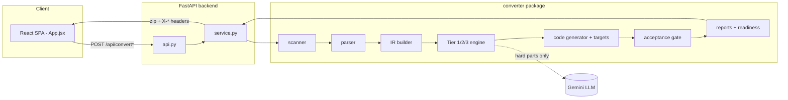
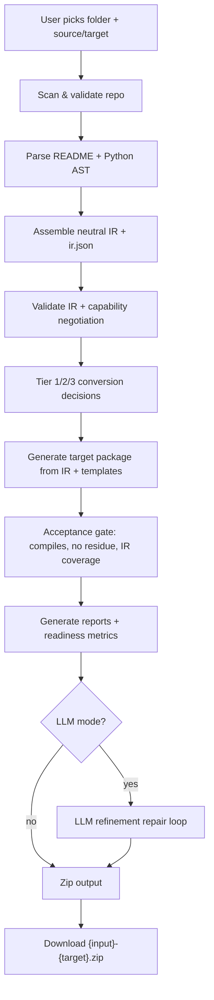

# Framework Conversion Utility

A code translator for AI agents. It reads an agent written in one framework
(e.g. **LangGraph**), re-describes what it does in a framework-neutral
**Intermediate Representation (IR)**, and re-writes that description using a
target framework's idioms (e.g. **Microsoft Agent Framework**, **CrewAI**,
**AWS Strands**, or **LangGraph**).

> The IR is the single source of truth. No stage after parsing looks at the
> original source again, and no stage before code generation knows what the
> target framework looks like. That one rule is what makes the system
> *any-source → any-target* without an N×M explosion of special cases.

---

## Table of contents

- [Project overview](#project-overview)
- [Problem statement](#problem-statement)
- [Business purpose](#business-purpose)
- [Key features](#key-features)
- [System capabilities](#system-capabilities)
- [Technology stack](#technology-stack)
- [Repository structure](#repository-structure)
- [High-level architecture](#high-level-architecture)
- [Quick start](#quick-start)
- [Backend setup](#backend-setup)
- [Frontend setup](#frontend-setup)
- [Environment variables](#environment-variables)
- [Running locally](#running-locally)
- [Build process](#build-process)
- [Deployment overview](#deployment-overview)
- [Usage guide](#usage-guide)
- [Example workflows](#example-workflows)
- [Generated outputs](#generated-outputs)
- [Troubleshooting](#troubleshooting)
- [FAQs](#faqs)
- [Further reading](#further-reading)

---

## Project overview

Teams that build agentic software get locked into whichever framework they
started with. Porting a working LangGraph agent to Microsoft Agent Framework
(MAF), CrewAI, or AWS Strands is normally a manual rewrite: re-express the
graph, re-wrap every tool, re-model the state, re-implement human-in-the-loop
(HITL), and re-test. This project automates the bulk of that rewrite.

The converter parses a source agent into a **framework-neutral IR**
([backend/converter/contracts.py](backend/converter/contracts.py)), then hands
that IR to a **target generator** that emits a self-contained, runnable package
in the destination framework — plus a set of Markdown reports that tell a human
exactly what was converted automatically, what needs review, and what must be
done by hand.

It ships two front doors over the same core:

- a **CLI** (`python -m converter.main`) for scripting and CI, and
- a **React + FastAPI web app** (the "Framework Conversion Utility") for
  interactive use — pick a folder, choose source/target, download a zip.

## Problem statement

Cross-framework agent migration is expensive and error-prone because each
framework has its own way of expressing the same five things:

1. **Tools** — decorators (`@tool`, `@ai_function`, …) and registration.
2. **State** — `TypedDict`, pydantic `BaseModel`, agent memory, or nothing.
3. **Orchestration** — graphs, sequential crews, or a model-driven agent loop.
4. **Human-in-the-loop** — `interrupt()`, `RequestInfoExecutor`,
   `human_input=True`, or a blocking tool.
5. **Checkpointing / persistence** — `MemorySaver`, file storage, sessions, or
   nothing.

A naïve converter would need a bespoke translator for every ordered pair of
frameworks (N×M). This system collapses that to **N source readers + M target
writers** by routing everything through one neutral IR.

## Business purpose

- **Reduce migration cost** — turn a multi-day manual rewrite into a
  minutes-long conversion plus a focused review of flagged items.
- **De-risk framework choice** — adopting a framework is no longer a one-way
  door; a proof-of-concept can be re-targeted cheaply.
- **Make effort estimable** — every conversion ships a **Production Readiness
  Report** with computed effort ranges and accuracy metrics, so a manager can
  see "70% ready, ~16 hrs of remaining work" instead of guessing.
- **Preserve institutional knowledge** — the generated `MIGRATION_REPORT.md`,
  `ACCEPTANCE.md`, and `READINESS_REPORT.md` document *why* each decision was
  made, not just what changed.

## Key features

- **Any-source → any-target** via a frozen neutral IR. Current matrix:
  sources `langgraph`, `crewai`, `aws_strands`, `maf`; targets `maf`,
  `langgraph`, `crewai`, `aws_strands`.
- **Three conversion modes** selected by `ConversionMode`
  ([config.py](backend/converter/config.py)): `hybrid` (default), `deterministic`,
  `full_llm`. Hybrid is fully implemented; the other two are droppable-in via the
  `PIPELINE_REGISTRY` in [main.py](backend/converter/main.py).
- **Tiered conversion engine** — Tier 1 deterministic rules (`R-01…R-15`),
  Tier 2 README-prose classification, Tier 3 LLM (Google Gemini) *only* for the
  hard parts (ambiguous orchestration, HITL).
- **Runnable output offline** — generated packages import and run without the
  target SDK installed (MAF ships a pure-Python SDK stub; the others guard
  imports and keep a deterministic offline `run()` path).
- **Capability negotiation** — before generating, the pipeline checks the IR's
  constructs against the target's capability matrix and flags LOSSY /
  UNSUPPORTED constructs.
- **Self-describing outputs** — every conversion emits README, migration,
  acceptance, install, architecture, readiness, and (LLM-mode) refinement docs.
- **Zero-config framework onboarding** — drop a `frameworks/<name>/vocabulary.json`
  and the framework appears in the API and UI automatically.
- **Web UI** with live activity log, computed KPI cards, and a correctly-named
  output zip (`{input-folder}-{target}.zip`).

## System capabilities

| Capability | Where it lives |
|---|---|
| Repo scan + validation (ignores `.venv`, `node_modules`, …) | `converter/scanner.py`, `Config.extraction_exclude_dirs` |
| AST-only source parsing (no regex on Python) | `converter/parser/code_parser.py` |
| IR assembly + `ir.json` checkpoint | `converter/ir/…`, `contracts.py` |
| IR validation + capability negotiation | `converter/engine/capability_negotiation.py` |
| Tier 1/2/3 conversion | `converter/engine/{tier1_rules,tier2_readme,tier3_llm}.py` |
| Code generation from IR + Jinja templates | `converter/generator/code_generator.py`, `templates/` |
| Logic porting (state→ctx AST transform) | `converter/generator/body_porter.py` |
| Target-specific emission | `converter/generator/targets/*_generator.py` |
| Acceptance gate (no residue, compiles, IR coverage) | `converter/generator/verify.py` |
| Reports (migration, readiness, docs) | `converter/generator/*_generator.py`, `readiness_report.py` |
| LLM refinement repair loop | `converter/generator/llm_refinement.py` |
| Web service + zip packaging | `backend/service.py`, `backend/api.py` |

## Technology stack

**Backend / engine (Python ≥ 3.10)**

- **FastAPI** + **uvicorn** — HTTP API (`backend/api.py`).
- **pydantic v2** — generated agent state models; request models.
- **Jinja2** — deterministic code/README templating (`converter/templates/`).
- **Python `ast`** — parsing source and validating every generated file.
- **google-genai** (optional) — Tier 3 LLM (Gemini); falls back to a stdlib
  `urllib` REST call, and degrades to deterministic stubs with no key.
- **pytest** — 276 tests, hermetic (no network).

**Frontend (Node / Vite)**

- **React 18** (single-page app, one `App.jsx` component).
- **Vite 5** + `@vitejs/plugin-react` — dev server (port 5173, proxies `/api`)
  and production build to `frontend/dist/`.

## Repository structure

```
framework-converter/
├── backend/
│   ├── api.py                 # FastAPI app — endpoints the frontend calls
│   ├── service.py             # conversion service (pipeline run + zip) shared by API & tests
│   └── converter/             # the conversion engine (importable package)
│       ├── contracts.py       # FROZEN neutral IR + all dataclasses/enums
│       ├── config.py          # Config, ConversionMode, .env loader
│       ├── main.py            # CLI entry point + PIPELINE_REGISTRY
│       ├── scanner.py         # repo scan + validation (Module 1)
│       ├── parser/            # README + AST code parsing (Modules 2–4)
│       ├── ir/                # IR assembly + validation (Module 5)
│       ├── engine/            # Tier 1/2/3 conversion + capability negotiation (Module 6)
│       ├── generator/         # code + report generation (Modules 7–9)
│       │   ├── code_generator.py
│       │   ├── body_porter.py
│       │   ├── verify.py
│       │   ├── readiness_report.py
│       │   ├── targets/       # per-framework TargetGenerators
│       │   └── ...            # report/readme/docs generators
│       ├── adapters/          # source + target framework adapters (registry)
│       ├── templates/         # Jinja templates for generated files
│       └── frameworks/        # Tier 3 knowledge packs (docs.md, examples/, vocabulary.json)
├── frontend/                  # React (Vite) SPA
│   ├── src/App.jsx            # the entire UI
│   ├── src/styles.css
│   └── vite.config.js
├── examples/sample_agent/     # a small LangGraph agent to try
├── FRAMEWORK_AUTHORING.md     # how to add/remove a framework
├── ARCHITECTURE.md            # authoritative architecture doc
├── ENGINEERING_GUIDE.md       # end-to-end data flow + onboarding + extension guide
└── FRAMEWORK_REFERENCE.md     # per-framework concepts + vocabulary.json schema
```

## High-level architecture



Workflow, end to end:



For the authoritative diagrams and rationale, see
[ARCHITECTURE.md](ARCHITECTURE.md); for a stage-by-stage data-flow walkthrough,
see [ENGINEERING_GUIDE.md](ENGINEERING_GUIDE.md).

## Quick start

```bash
# 1. Backend (from repo root)
python -m venv .venv && .venv\Scripts\activate      # Windows
pip install -r requirements.txt
python -m uvicorn api:app --app-dir backend --reload --port 8000

# 2. Frontend (separate terminal)
cd frontend
npm install
npm run dev        # http://localhost:5173, proxies /api -> :8000
```

Then open the UI, paste the path to `examples/sample_agent`, choose
**LangGraph → AWS Strands** (or any pair), and click **Convert & download**.

## Backend setup

Requirements: Python ≥ 3.10.

```bash
pip install -r requirements.txt      # Jinja2, pydantic, fastapi, uvicorn, pytest, httpx
# optional, for Tier 3 LLM:
pip install google-genai truststore
```

Run the tests (hermetic — no network, no API key needed):

```bash
python -m pytest backend/converter/tests -q      # 276 passed
```

The package is also installable (`pyproject.toml`, console script
`convert-agent = converter.main:main`).

## Frontend setup

Requirements: Node 18+.

```bash
cd frontend
npm install
npm run dev        # dev server on :5173
npm run build      # production build -> frontend/dist/
npm run preview    # preview the built app
```

If the backend runs on a different origin, set `VITE_API_BASE` (e.g. in
`frontend/.env`) to that origin; otherwise the app calls same-origin `/api`.

## Environment variables

| Variable | Read by | Purpose | Default |
|---|---|---|---|
| `GEMINI_API_KEY` | `Config.llm_api_key()` | Enables Tier 3 LLM + refinement. Absent → deterministic stubs. | unset |
| `GEMINI_MODEL` | `Config.resolved_model()` | Override the Gemini model. | `gemini-2.0-flash` |
| `VITE_API_BASE` | `frontend/src/App.jsx` | Backend origin for the SPA. | same-origin `/api` |

`.env` files are loaded by a zero-dependency loader
(`config.py::_load_dotenv_once`) that searches `cwd/.env`, `backend/.env`, and
the repo-root `.env`, in that order. **Already-set environment variables always
win** — `.env` never overrides them. Copy any generated `.env.example` in the
output to `.env` and fill in secrets before running a converted agent.

## Running locally

**CLI:**

```bash
cd backend
python -m converter.main --input ../examples/sample_agent \
                         --output ../converted \
                         --source langgraph --target aws_strands \
                         --mode hybrid
```

- `--input` — source agent folder (needs a root `README.md` and ≥1 `.py`).
- `--output` — destination folder for the converted package + reports.
- `--source` — source framework (omit to auto-detect from imports).
- `--target` — target framework (`maf`, `langgraph`, `crewai`, `aws_strands`, or
  a custom pack name).
- `--mode` — `hybrid` (default) | `deterministic` | `full_llm`.

**Web UI:** run both servers (see [Quick start](#quick-start)) and use the
browser. Path mode is recommended for large folders (nothing is uploaded; the
backend reads from disk and skips dependency directories).

## Build process

- **Frontend:** `npm run build` produces `frontend/dist/` (git-ignored). The
  Vite config uses `base: './'` so FastAPI can serve the built app at `/`.
- **Backend:** no build step — it runs from source. If `frontend/dist/` exists,
  `api.py` mounts it at `/` (`StaticFiles`), so a single uvicorn process can
  serve both API and UI.

## Deployment overview

The simplest deployment is a single uvicorn process serving the built SPA and
the API together:

```bash
cd frontend && npm run build && cd ..
python -m uvicorn api:app --app-dir backend --host 0.0.0.0 --port 8000
```

Notes:

- CORS is wide-open (`allow_origins=["*"]`) — restrict it before exposing the
  API publicly.
- The conversion endpoints run the full pipeline **synchronously** in the
  request; there is no queue or background worker (see
  [ARCHITECTURE.md](ARCHITECTURE.md) → *Scalability considerations*).
- Path mode (`/api/convert-path`) reads folders from the backend's own disk, so
  the backend must be co-located with the source code. For remote/multi-machine
  use, use upload mode (`/api/convert`).

## Usage guide

1. **Choose an input** — either paste a local path (recommended) or upload a
   folder. The browser filters out dependency dirs and binaries before upload.
2. **Choose source & target** — the dropdowns are populated from
   `GET /api/frameworks`. Pick "New / custom framework…" to upload a
   `vocabulary.json` pack for an unknown target.
3. **Choose how to handle complex parts:**
   - **LLM assists, I review** (`mode=llm` → `HYBRID`) — Gemini drafts the hard
     orchestration/HITL; output is reviewable and flagged.
   - **I'll complete it manually** (`mode=manual` → `DETERMINISTIC`) — hard
     parts become clearly-marked stubs; no LLM is used.
4. **Convert & download** — a zip named `{input-folder}-{target}.zip` downloads,
   and KPI cards show target, files converted, time, readiness %, accuracy, and
   remaining effort (read from `X-*` response headers).

## Example workflows

**LangGraph → AWS Strands (the reference case):** the bundled
`examples/sample_agent` is a "Test Optimiser" LangGraph agent with two tools, a
`generate → gate` loop, a `route` router, and an `interrupt()` HITL node.
Converting it to AWS Strands produces an orchestrator where each node is a real
`@tool` running the ported logic on a shared `AgentContext`, driven in the
source order with the loop and router preserved. See
[ENGINEERING_GUIDE.md](ENGINEERING_GUIDE.md) for the exact transformation.

**Any pair:** the same input can target MAF (a `WorkflowBuilder` graph with a
bundled offline SDK stub), CrewAI (a sequential `Crew` or a branching `Flow`),
or LangGraph (a real `StateGraph`). The [test matrix](backend/converter/tests/test_all_frameworks_matrix.py)
exercises the full cross-product.

## Generated outputs

A converted package is a self-contained tree, typically:

```
{output}/
├── agent_context.py        # state as a pydantic model with .advance()
├── config.py               # carried config constants
├── orchestrator.py         # ported nodes/routers + synthesized orchestration
├── plugins/                # tools as target-idiom @-decorated functions
├── main.py                 # fresh entrypoint (CLI or FastAPI)
├── tests/test_smoke.py     # offline smoke test
├── requirements.txt        # deps detected from the converted code
├── .env.example            # one line per detected env var
├── README.md               # target-vocabulary README
├── MIGRATION_REPORT.md     # auto / needs-review / manual-action buckets
├── ACCEPTANCE.md           # gate results (compiles, no residue, IR coverage)
├── INSTALL.md, ARCHITECTURE.md
├── READINESS_REPORT.md     # effort + accuracy metrics (human-facing)
├── readiness_metrics.json  # machine-readable metrics (the UI reads this)
└── REFINEMENT_LOG.md       # (LLM mode) what the repair loop changed
```

## Troubleshooting

| Symptom | Cause | Fix |
|---|---|---|
| UI says "Cannot reach the backend" | uvicorn not running / wrong port | Start `uvicorn api:app --app-dir backend --port 8000`; check `VITE_API_BASE`. |
| `400 Unknown target framework` | target not registered and no pack | Use a known target, or upload a `vocabulary.json` pack. |
| `ScannerError` on convert | missing root `README.md` or no `.py` | Ensure the source folder has both. |
| Readiness validation `ValueError` | no accuracy dimensions parsed | Indicates a generation problem upstream; check `MIGRATION_REPORT.md`/logs. |
| Output has `# SYNTAX ERROR` banner | a generated file failed `ast.parse` | Listed in `MIGRATION_REPORT.md` (manual-action); port that file by hand. |
| Tier 3 didn't run | no `GEMINI_API_KEY` | Set the key, or accept deterministic stubs (manual mode). |
| Converted agent imports but errors at runtime | ported logic / LLM client needs manual port | Check `READINESS_REPORT.md`; runtime behaviour is never auto-verified. |

## FAQs

**Does it execute the converted agent?** No. Every generated `.py` is
`ast.parse`-validated for syntax and the package is import-checked, but the
converter never runs the agent. Runtime verification is a manual step.

**Do I need a Gemini API key?** No. Without a key the pipeline runs fully
deterministically; hard parts become flagged stubs instead of LLM-authored code.

**How do I add a new framework?** Drop a `frameworks/<name>/vocabulary.json` for
a zero-code target, or add a `SourceAdapter` / `TargetAdapter` / `TargetGenerator`
for full control. See [FRAMEWORK_AUTHORING.md](FRAMEWORK_AUTHORING.md) and
[FRAMEWORK_REFERENCE.md](FRAMEWORK_REFERENCE.md).

**Why an IR instead of direct translation?** To avoid N×M translators. Each new
framework is one reader and/or one writer against the frozen contracts in
[contracts.py](backend/converter/contracts.py); no existing code changes.

**Where are the metrics on the UI computed?** Deterministically in
`readiness_report.py::compute_readiness_metrics`, written to
`readiness_metrics.json`, surfaced by `service.py` as `X-*` headers the SPA reads.

## Further reading

- [ARCHITECTURE.md](ARCHITECTURE.md) — components, service interactions, design
  decisions, trade-offs, extensibility model, Mermaid diagrams.
- [ENGINEERING_GUIDE.md](ENGINEERING_GUIDE.md) — the full execution flow stage by
  stage, codebase walkthrough, onboarding, and how to extend every seam.
- [FRAMEWORK_REFERENCE.md](FRAMEWORK_REFERENCE.md) — MAF / LangGraph / CrewAI /
  AWS Strands concepts and the `vocabulary.json` schema.
- [FRAMEWORK_AUTHORING.md](FRAMEWORK_AUTHORING.md) — the framework add/remove
  lifecycle.
